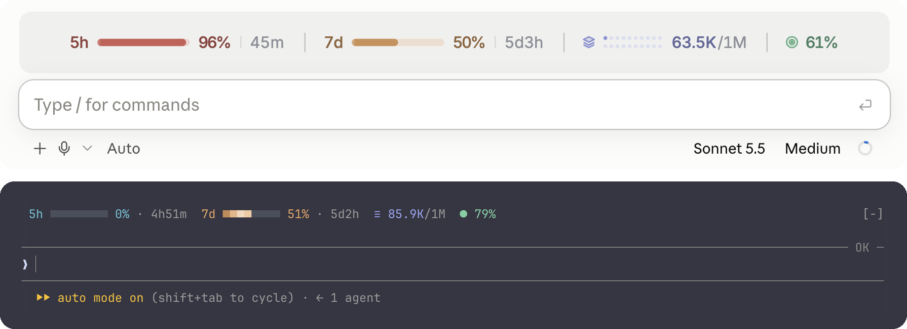
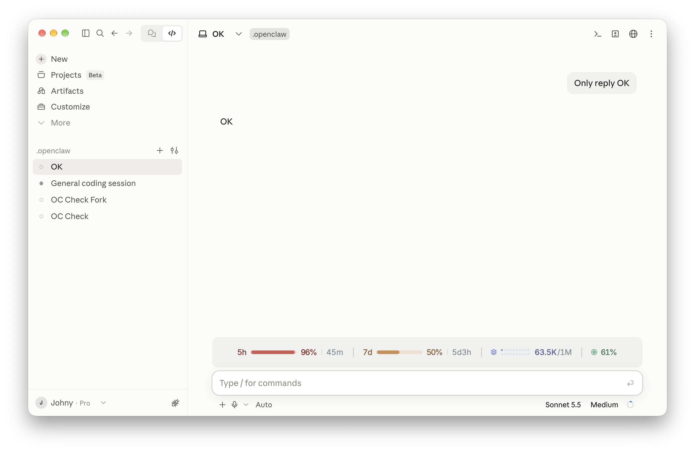
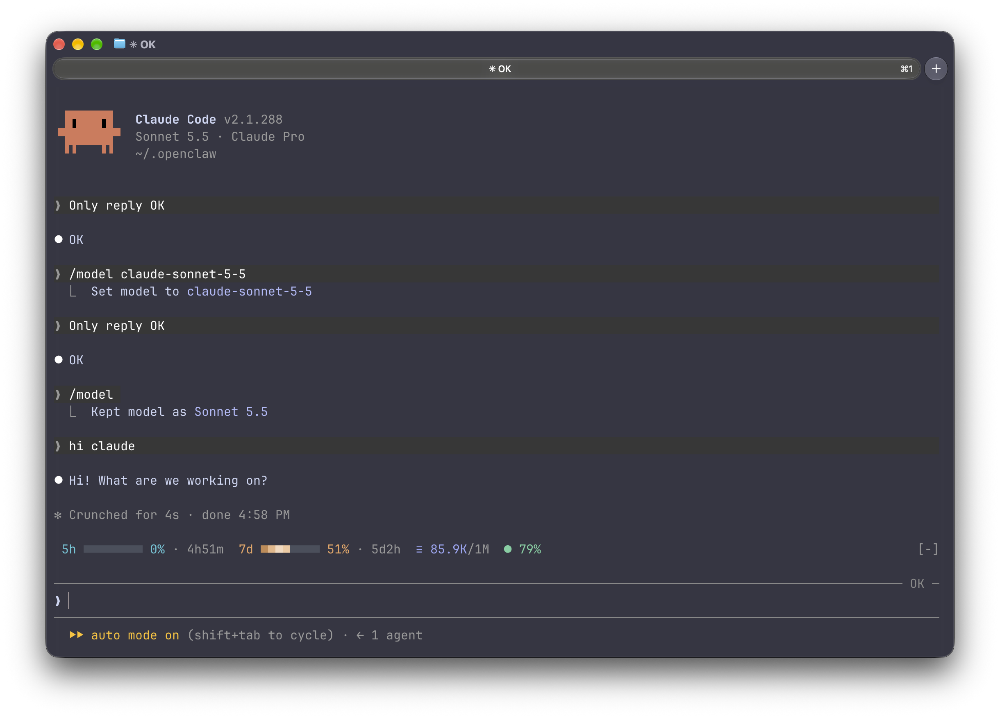

<div align="center">

# CC-Usage-Band

**Your Claude Code limits, context and cache, one glance above the prompt.**

[](./LICENSE)
[](https://claude.com/claude-code)
[](https://claude.com/blog/claude-code-mods)


English · [简体中文](./README.zh-CN.md)



</div>

---

`usage-band` is a [Claude Code mod](https://claude.com/blog/claude-code-mods) that draws a single line above the prompt with the four numbers worth watching while you work. It has its own layout for the terminal and for the desktop app, updates itself after every turn, and stays out of the way until something needs attention.

## Contents

- [Features](#features)
- [Requirements](#requirements)
- [Installation](#installation)
- [Configuration](#configuration)
- [What the numbers mean](#what-the-numbers-mean)
- [Terminal compatibility](#terminal-compatibility)
- [Privacy and permissions](#privacy-and-permissions)
- [Development](#development)
- [Screenshots](#screenshots)
- [License](#license)

## Features

| Metric | Shows |
| --- | --- |
| **5h** limit | How much of the rolling 5-hour window you have used, and when it resets |
| **7d** limit | The same for the weekly window |
| **Context window** (layers icon) | Tokens in the context out of the model's window, e.g. `398K/1M` |
| **Cache hit rate** (target icon) | How much of the last turn's input the prompt cache served |

- **Glanceable.** Each metric has its own color. It turns red only when it needs you: a limit or the context past 80%, or a cache hit rate under 50%.
- **Alive, not noisy.** A slow shine sweeps across the limit bars, every bar in step.
- **Native on both surfaces.** Terminal: a character line with Nerd Font or Unicode icons that fits itself to the window width. Desktop app: a centered SVG row with bars, a 2×10 dot matrix for the context window, and light and dark mode.
- **Light.** No files read, no processes, no network. It only listens to the usage figures Claude Code already has.

## Requirements

- Claude Code **2.1.287 or newer** (the release that introduced mods), in the terminal or the desktop app's Code tab
- A Claude subscription for the 5h and 7d figures. Without one, the band shows the context window and cache hit rate only.

## Installation

Run these inside Claude Code:

```
/plugin marketplace add JetsonChan/CC-Usage-Band
/plugin install usage-band@cc-usage-band
```

Start a new session and the band appears above the prompt. The limit figures arrive with the session's first response.

To try it for one session from a local checkout instead:

```bash
git clone https://github.com/JetsonChan/CC-Usage-Band.git
claude --plugin-dir CC-Usage-Band/usage-band
```

**Update**

```
/plugin marketplace update cc-usage-band
```

**Uninstall**

```
/plugin uninstall usage-band@cc-usage-band
```

## Configuration

| Option | Values | Default | Description |
| --- | --- | --- | --- |
| `icons` | `auto` · `nerd` · `unicode` · `ascii` | `auto` | Terminal icon set. `auto` uses Nerd Font icons in Ghostty, which ships them, and plain Unicode elsewhere. Choose `nerd` if your terminal font is a Nerd Font, `ascii` for the most basic terminals. The desktop app draws its own icons and ignores this. |

Change it with `/plugin` (configure `usage-band`) or `/config` in a terminal session.

## What the numbers mean

| Metric | Source | Notes |
| --- | --- | --- |
| 5h / 7d | The rate-limit windows Claude Code reads from each API response | Rounded to whole percent. The reset time counts down every minute. |
| Context | The last request's input: uncached + cache reads + cache writes | Against the current model's window, so 1M and 200K models both read right. On desktop each dot is 5% of the window, filling the top row first. |
| Cache hit | Last turn's `cache_read / (input + cache_read + cache_write)` | Summed over every request in the turn. Subagent turns are not counted. |

## Terminal compatibility

| Terminal | Icons with `auto` | Colors |
| --- | --- | --- |
| Ghostty | Nerd Font (built in) | Truecolor |
| iTerm2, WezTerm, kitty, Warp | Unicode (`≡` `●`) | Truecolor |
| macOS Terminal | Unicode | 256 colors, mapped automatically |
| Anything else | Unicode | Whatever the terminal reports |

If icons show as boxes, set `icons` to `unicode`. Run `/usage-band-preview` to compare every style in your own terminal.

## Privacy and permissions

Mods run with the same access as Claude Code itself and are not sandboxed, so here is everything this one touches:

- **Reads** the session's usage figures (`session.measure`, `turn.complete`, `$.session.usage`) and the `TERM_PROGRAM` environment variable
- **Registers** one command, `/usage-band-preview`
- **Draws** the band above the prompt

It does not read or write files, run processes, call the network or send any data anywhere. The whole mod is one file: [`usage-band/hooks/register.tsx`](./usage-band/hooks/register.tsx).

## Development

```
.
├── .claude-plugin/marketplace.json   # the cc-usage-band marketplace
└── usage-band/
    ├── .claude-plugin/plugin.json    # manifest and the icons option
    ├── hooks/register.tsx            # the mod
    ├── types/index.d.ts              # state contract
    └── tests/band.test.ts
```

```bash
cd usage-band
claude plugin validate .
claude plugin test .
```

While editing, load it with `claude --plugin-dir ./usage-band`; the session reloads it when a file changes.

Issues and pull requests are welcome.

## Screenshots

**Desktop app, light mode.** The 5h limit is past 80%, so it has turned red.



**Desktop app, dark mode**


**Terminal** (Ghostty). Narrow terminals drop the bars first, then the reset times. Run `/usage-band-preview` to see every terminal style side by side.



## License

[MIT](./LICENSE) © Jetson Chan
